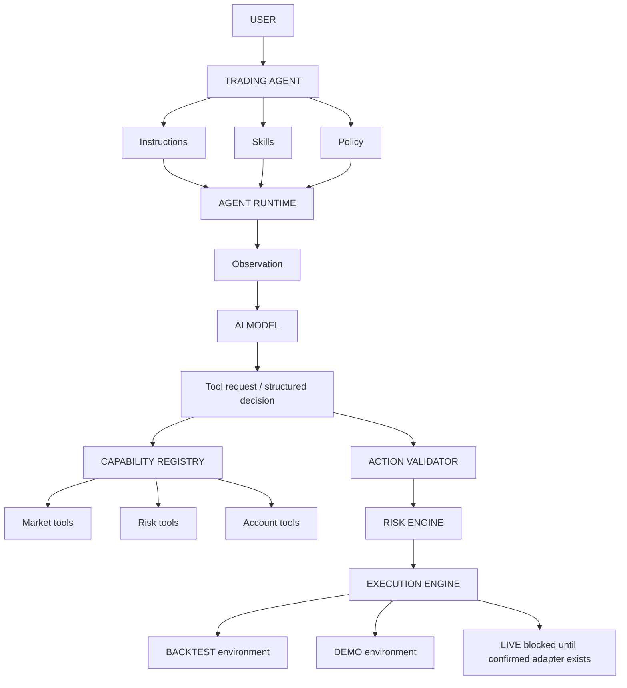
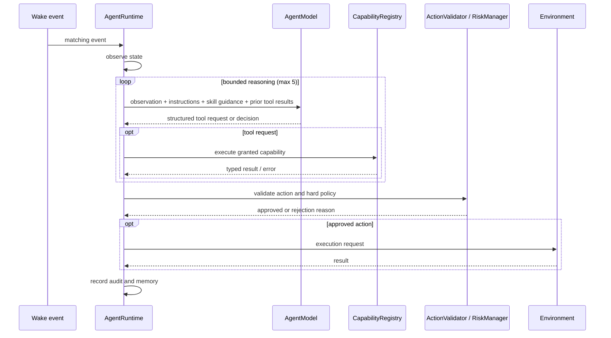

# Trading Agent Runtime (V1)

Trading Agents are a new internal runtime abstraction; existing Bots and the Monaco strategy runtime remain supported. The runtime treats model output as untrusted data. Models receive a normalized observation and can request only capabilities granted both by the agent definition and its enabled skills. The application selects the environment; the model cannot switch it. A model without a configured OpenRouter key uses the deterministic local model fallback.

## Lifecycle and tool flow

Wake events are filtered by the agent's configured symbols. Each step collects a quote, recent bars, account state, open positions, active session, assigned skills and capability identifiers. The model is called for at most five iterations. Each tool request is checked against capabilities allowed by the skills and the agent allowlist, executed by the registry, and appended to tool history. A structured decision is validated; order intents additionally pass the application risk manager before the configured environment's execution method is called. Decisions, requests, outputs, validation and execution results are retained in a bounded in-memory audit log and scoped agent memory.

## Risk boundary

Agent natural-language instructions and model output cannot change policy or choose the environment. Opening a position requires an allowed symbol, a protective stop, a position/exposure budget, daily-loss/drawdown compliance, and the configured risk-per-trade ceiling. It then passes TradingGOATs's existing `RiskManager`. Execution capabilities cannot place orders outside the same validation path; unsupported limit/cancel calls fail closed. Account/order state is read through environment contracts; adapters must provide authoritative values before live operation.

## Environments and limitations

`BacktestEnvironment` uses the supplied historical bars and advances deterministically when its caller changes the bar index; `replayAgentBacktest` offers the first simple event-by-event runtime driver. `DemoEnvironment` routes through the Hyperliquid DEMO adapter, which simulates fills against real venue bid/ask and owns all execution state. It also exposes instrument metadata so policy and risk can value a mixed-asset book. `LIVE` is disabled: its environment factory fails closed because no live implementation exists. The existing `BacktestSimulator` and strategy-code loop remain intact.

## Auditing and security

No model receives browser globals, storage, filesystem, network clients, secrets or broker objects as model request fields. OpenRouter is called only inside the existing provider abstraction. Model tool/decision payloads are parsed as untrusted JSON and bounded by iteration count. Capability registration is application code only. Audit records must not include credentials; model prompts contain normalized trading state only.

## Example agent

`CONSERVATIVE_EURUSD_AGENT` is a DEMO-only integration fixture with EURUSD scope, 1% risk, one open position maximum and the six foundational skills. It is not a performance claim or profitability promise.

The runtime receives tracker context through `AgentWakeEvent.data` and includes its concise wake reason in the model request. Tracker persistence, cooldowns, and timeline records are in-memory for V1. The built-in fallback model defaults to non-executing WAIT decisions. Demo adapter/account authority and daily historical P&L require production adapter work before any live deployment.

---

## Wallet and signing boundary

The agent runtime has no access to the wallet.

* No capability in `CapabilityRegistry` reaches Privy, a wallet provider, a
  signer, a private key, or a seed phrase. The wallet lives behind
  `src/services/wallet/`, which the runtime never imports.
* `signMessage` on the wallet service is a user-facing message signature. It
  is not a capability, so no skill can invoke it, and it is not an
  order-signing path.
* An agent can request a trade intent. `ActionValidator` and `RiskManager`
  decide whether it is allowed. An agent cannot approve, resize, downgrade, or
  retry past a rejection, cannot sign, and cannot transmit an order.
* `createLiveEnvironment()` fails closed, so an agent cannot be registered
  against a LIVE environment.
* `bun run test:wallet` asserts each of these and fails if a signing, key, or
  wallet capability is ever registered.
