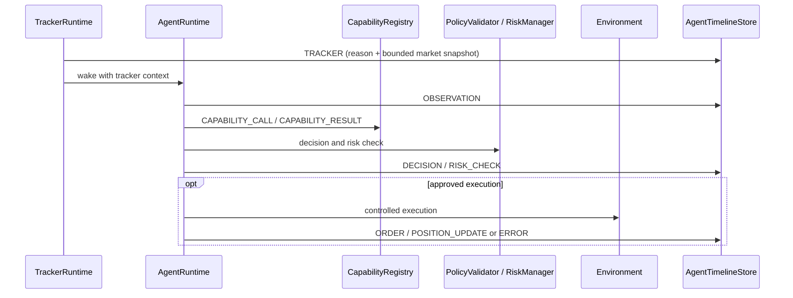

# Agent Timeline

`AgentTimelineStore` is a bounded, in-memory application store with agent/time/type queries and trade/position correlation queries. It is injected into the existing `AgentRuntime` and shared with `TrackerRuntime`; replacing the store with durable application persistence is an extension point, not part of this in-memory V1.

Timeline events carry agent, tracker, environment and optional trade/order/position/correlation identifiers. Observation snapshots include only relevant quote, recent bars, account summary, positions, orders and session; they are bounded. Capability inputs/results are summarized and sensitive-key values redacted. Errors are recorded without credentials.

The timeline stores concise decisions and reasons only. It does not persist model `thought` fields or hidden chain-of-thought. Risk Engine decisions remain authoritative; timeline records them, not overrides them. Execution/position events are recorded only when returned/emitted by the configured environment and existing domain event bus—no fills or positions are fabricated.

A successful agent market order's returned position identifier is linked to later scoped position update/close events. Trade query support is included in the store; complete trade-ID correlation depends on environment adapters supplying authoritative position/trade identifiers. The existing demo adapter is mock-backed; production account/execution authority is not implied by this architecture.
