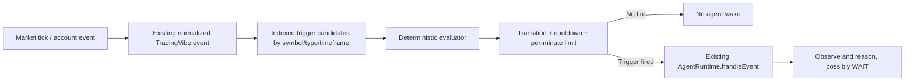

# Agent Trigger Engine

## Flow

**Ticks are data; triggers are meaning. Triggers wake agents and never imply a trade.** `TriggerRegistry` validates owner, symbol/timeframe scope, config and safety fields. `TriggerEngine` sorts simultaneous firings by priority descending then id, evaluates indexed symbol candidates and active agents only, enforces cooldown/frequency controls, records a timeline trigger, and calls the existing runtime. The runtime must already be running. LIVE event ingestion is rejected. Domain event-bus ingestion remains disabled until the caller explicitly selects its DEMO/BACKTEST source environment; `ingest(event, environment)` is available for explicit per-event source selection.

Supported conditions include new closed bars, price thresholds/crosses, EMA/SMA/RSI/ATR crosses using existing deterministic indicator functions, rolling/configured breakouts, spread and ATR volatility transitions, position updates, actual filled order events, stop/target proximity, explicitly timed session boundaries, scheduled intervals/local clock times, and named custom events. Custom events are names/data only: no custom JavaScript runs.

Scheduled triggers are evaluated only when events are passed to the engine. Interval schedules use event timestamps; clock schedules use an explicit IANA timezone. Backtests should pass historical event time, not wall-clock time. Session configs contain explicit `startsAt`/`endsAt` epoch milliseconds and timezone. The event adapter currently obtains quote/bar/order/position events from the existing event bus; the backtest helper supplies historical bar events directly.

Frequency limits are per-trigger, defaulting to at most 10 firings per minute; default cooldown is one second. `PRICE_THRESHOLD` fires only after an observed prior sample entered the opposite state and transitioned; cross conditions also require previous/current values. `NEW_BAR` deduplicates timeframe buckets. Scheduled triggers require calling `tickScheduled` with environment-clock time. Session triggers require `emitSessionBoundaries` with explicit session configuration. Risk/position event sources require explicit scoped methods; account state is not fabricated from a global broadcast.

Failures (bad event/config, unavailable agent, runtime wake error) are recorded as timeline errors and never produce an execution directly. Risk and execution remain in AgentRuntime and TradingVibe RiskManager.
