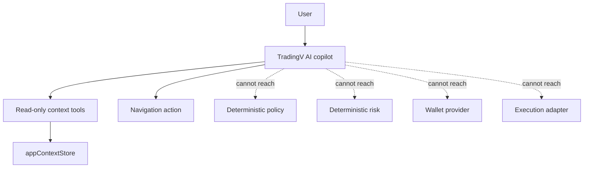

# TradingV AI — the copilot

TradingV AI is the in-app assistant. It reads the application, explains
what is happening, and gets the user to the right screen. It is not a
trading agent, and it is not a chat box bolted onto the product.

---

## 1. Three layers, and which one this is



The copilot lives entirely in the **AI layer**. It proposes navigation and
explanations. The **deterministic engine** is the only thing that can
change account state, and the copilot has no path to it.

The separate **agent runtime** (`src/engine/agents/`) is what actually
trades. It has its own narrow decision prompt, its own tools, and its own
policy. The two never share a prompt: `TRADINGV_PRODUCT_CONTEXT` teaches
the copilot about the product, and the agent prompt in
`src/adapters/openrouter/provider.ts` is the trading-decision contract. The
copilot prompt is not allowed to issue decisions.

---

## 2. What it can do

* **Explain the product.** "How do I create a bot?" answers with the
  actual navigation path, and offers an `Open Bots` / `Create Bot`
  button.
* **Read the user's own data.** Open positions, closed trades, equity,
  exposure, markets, GOATs, trackers, risk limits, and the wallet
  connection state.
* **Teach the bot model.** "I want a Gold bot that watches RSI below 30"
  becomes market, observation, investigation, risk, execution — explained as
  those five steps, not as an order.
* **Refuse honestly.** "Place this trade live" gets a plain answer that
  live execution is not implemented, plus a DEMO or BACKTEST alternative.

## 3. What it cannot do

* It cannot place, modify, or close a trade.
* It cannot change a risk limit, a policy, or the execution environment.
* It cannot enable LIVE. `LIVE` cannot be set anywhere in the app.
* It cannot fabricate a price, position, trade, or tracker observation. If a tool
  did not return it, the copilot does not know it.
* It cannot read a private key, seed phrase, signing secret, or API key,
  and it is never given one.

A position close is offered as a **confirmation card**, not an action: the
copilot explains what would happen and the user taps to confirm.

---

## 4. Read-only application context

`src/services/aiContext/` holds a sanitised projection of state the app
already has. The App publishes into it; the copilot reads from it.

```
src/services/aiContext/
├── types.ts        snapshot shapes + the secret guard
├── store.ts        shallow-merged, copy-on-read
├── tools.ts        narrow readers
├── prompt.ts       the product prompt + slice rendering
├── navigation.ts   the navigation allow-list
└── tests.ts
```

### Tools

| Tool | Reads |
| ---- | ----- |
| `getCurrentAppContext` | screen, tab, selected market/bot, environment |
| `getAccountState` | balance, equity, margin, P&L, risk state |
| `getOpenPositions` | open positions and their levels |
| `getRecentTrades` | closed trades and realized P&L |
| `getAvailableMarkets` | discovered instruments, availability, precision |
| `getMarketQuote` | one market: bid, ask, size limits |
| `getBots` / `getBot` | bot list and detail |
| `getTrackers` | tracker definitions and rate limits |
| `getRiskState` | deterministic limits and current state |
| `getWalletState` | wallet connection state only |

The copilot picks the slices a question needs (`selectSlices`), so a
question about positions does not drag the whole market table into the
prompt. Every returned payload passes `assertNoSecrets`, which refuses
credential-shaped keys and values — raw 32-byte hex, long unlabelled
base64, and provider key prefixes — while still allowing a public `0x`
address.

The chat panel exposes the same list under "What I can read", so the
user can see exactly what the model is given.

---

## 5. Navigation actions

The copilot may end a reply with a bracketed action marker. Only these
targets are accepted:

`TRADES`, `BOTS`, `QUOTES`, `HISTORY`, `SETTINGS`, `CREATE_BOT`,
`INSPECT_TRACKERS`, `INSPECT_THESIS`

Anything else is dropped, so a hallucinated `PLACE_ORDER` or
`ENABLE_LIVE` cannot reach a handler. The marker is stripped from the
visible message and rendered as a button instead.

---

## 6. BYO OpenRouter key

The model provider is still **bring your own key**. The user adds it in
Settings and it is stored in that browser's `localStorage` and sent
directly from the browser to OpenRouter.

Security implications, stated plainly:

* The key is readable by any script running on the page, so it is only as
  safe as the app. TradingV does not proxy it and does not log it.
* It is never sent to a TradingV server, because there is no TradingV
  server for this path.
* Without a key, AI features are unavailable rather than silently
  downgraded. The assistant explains this and links straight to Settings.
* `VITE_OPENROUTER_API_KEY` exists for a build-time key and is **public**.
  Per-user keys are the recommended path.

---

## 7. Prompt shape

```text
system  : TRADINGV_PRODUCT_CONTEXT        (vocabulary, the three layers,
                                           the loop, the hard rules)
         + <read-only application context for the slices asked about>
user    : the question
assistant: the answer, optionally ending in a navigation marker
```

The context block is rendered compactly, one line per item, and states
explicitly when something is unavailable (for example
`live execution available: no`) so the model cannot infer a value that
was not measured.
