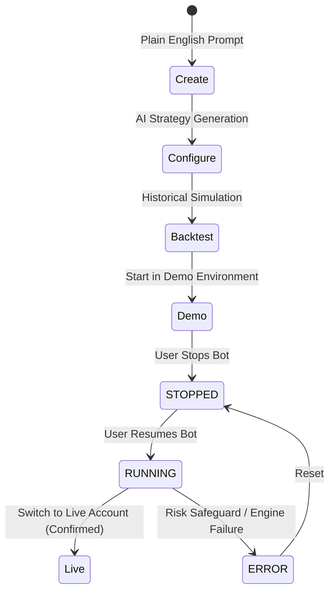

# Bot Automation & Strategy Blueprints

This document details the trading bot lifecycle, state transitions, and explore blueprints in **TradingVibe**.

---

## 1. Bot Lifecycle State Machine

### Bot Statuses:
* `RUNNING`: Actively monitoring live ticks and placing orders (`● RUNNING`).
* `STOPPED`: Bot is paused; positions remain open or are safely flattened (`○ STOPPED`).
* `TESTING`: Historical simulation or sandbox sanity checks in progress (`◐ TESTING`).
* `ERROR`: Execution halted due to risk breach or invalid logic (`⚠ ERROR`).

---

## 2. Conversational Bot Creation

Users without coding backgrounds create automated bots conversationally:

1. **Prompt Entry**: The user describes what they want in plain English (e.g. *"Trade EURUSD when price breaks the London session high with RSI above 50 and 25 pips Stop Loss"*).
2. **AI Structuring**: TradingVibe's strategy generator infers the instrument, timeframe, entry criteria, and risk parameters.
3. **Structured Review Card**: Displays the configured parameters in clear bullet points.
4. **Immediate Verification**: The user can run a historical backtest or deploy directly into their Demo account with one tap.

---

## 3. Curated Explore Blueprints

TradingVibe includes pre-configured, audited strategy blueprints across major categories:

| Blueprint Name | Category | Symbol | Timeframe | Strategy Description |
|---|---|---|---|---|
| **London Breakout** | Breakout | `EURUSD` | `5m` | Captures expansion moves outside the London pre-market opening range. |
| **EMA Trend & RSI** | Trend Following | `GBPUSD` | `15m` | Rides sustained trends using 20/50 EMA momentum with RSI exhaustion filters. |
| **RSI Reversal Scalper** | Mean Reversion | `USDJPY` | `5m` | Exploits price exhaustion when RSI dips below 30 or rallies above 70. |
| **Volatility Squeeze** | Beginner | `XAUUSD` | `1h` | Detects consolidation followed by high-momentum expansions on Gold. |

### Anti-Hype Policy
TradingVibe strictly prohibits deceptive marketing banners such as *"#1 BOT"*, *"GUARANTEED WINNER"*, or inflated return promises. Blueprints clearly state what market mechanics they trade and their risk profiles.
