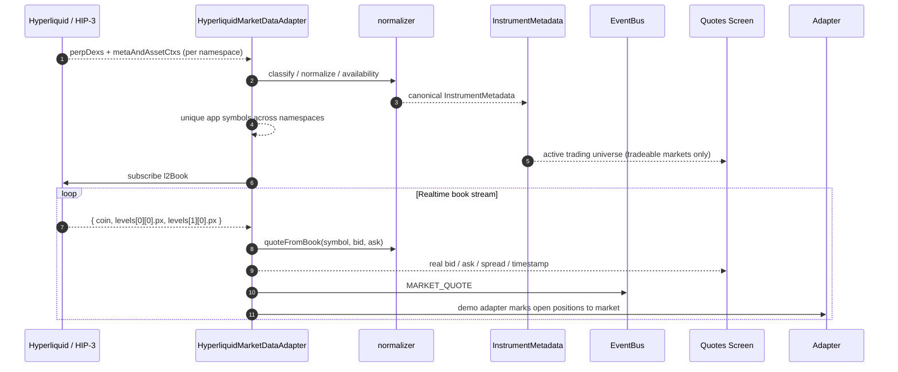
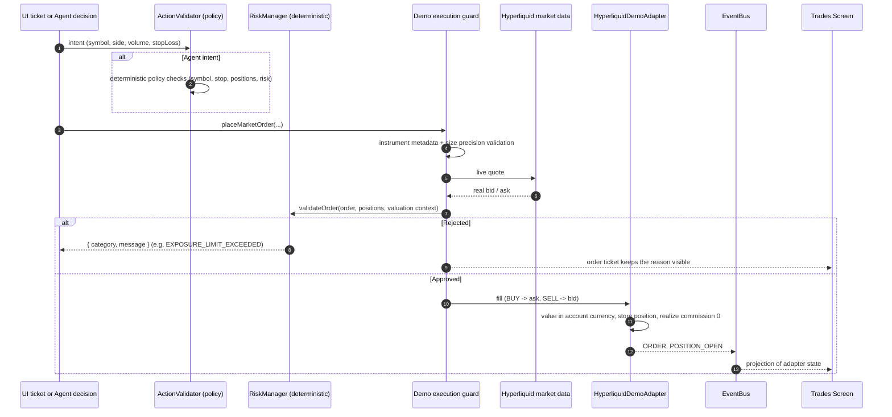
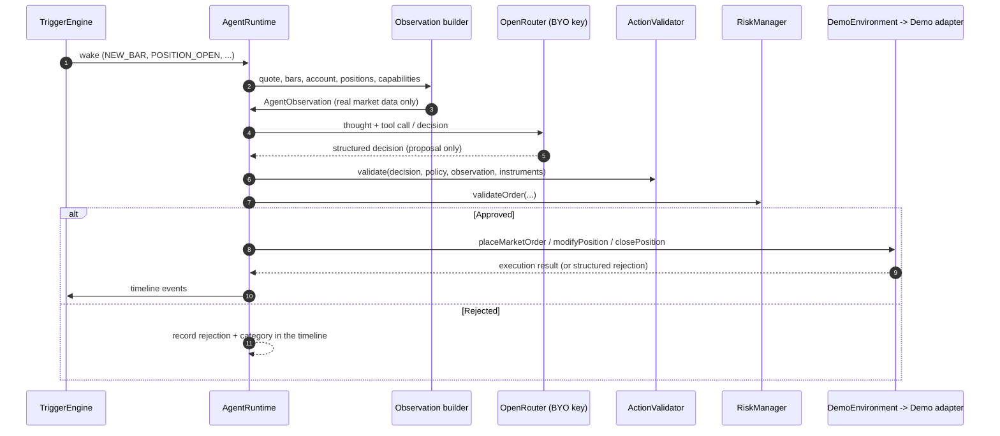
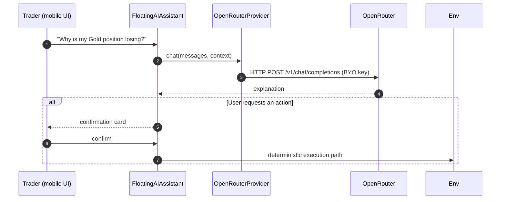

# Data Flow Architecture

How data moves through **TradingVibe**: Hyperliquid market data, order
execution, agent activity, and user-AI interaction.

---

## 1. Market Data Flow

Key properties:

* Prices come only from the provider. No synthetic quote exists anywhere in
  the production path.
* A market the provider lists without a book is `UNAVAILABLE`: kept in
  metadata, excluded from the active universe, and never priced.
* Bars come from `candleSnapshot` / the `candle` stream and are independent of
  the quote stream; a quote tick never mutates the current candle.

---

## 2. Order Execution Flow

Safeguards:

1. **One execution guard.** Manual tickets, agent capabilities, and the
   runtime all reach the same adapter, so sizing and validation rules cannot
   diverge.
2. **Deterministic risk.** Policy and risk run in code, never in the model.
   An AI agent cannot bypass them, and a rejection is identical for manual and
   agent orders.
3. **Valued in the account currency.** Exposure, stop risk, and P&L are
   computed per instrument from its metadata, then summed. Quantities of
   unrelated instruments are never added together.
4. **Adapter owns execution state.** Positions, P&L, trades, and balance are
   produced once, in the adapter. The UI projects them.

---

## 3. Agent Runtime Flow

The runtime is environment-agnostic: DEMO, BACKTEST, and a future LIVE
environment all satisfy the same `ITradingEnvironment` contract, including the
optional `getInstruments()` metadata read. The agent never learns provider
details and never holds credentials.

---

## 4. Conversational AI Assistant Flow

Safety policy:

* The AI explains and proposes; it never executes on its own.
* Every action goes through the same deterministic policy and risk gate as a
  manual order.
* The AI never receives keys, signing authority, or custody.
