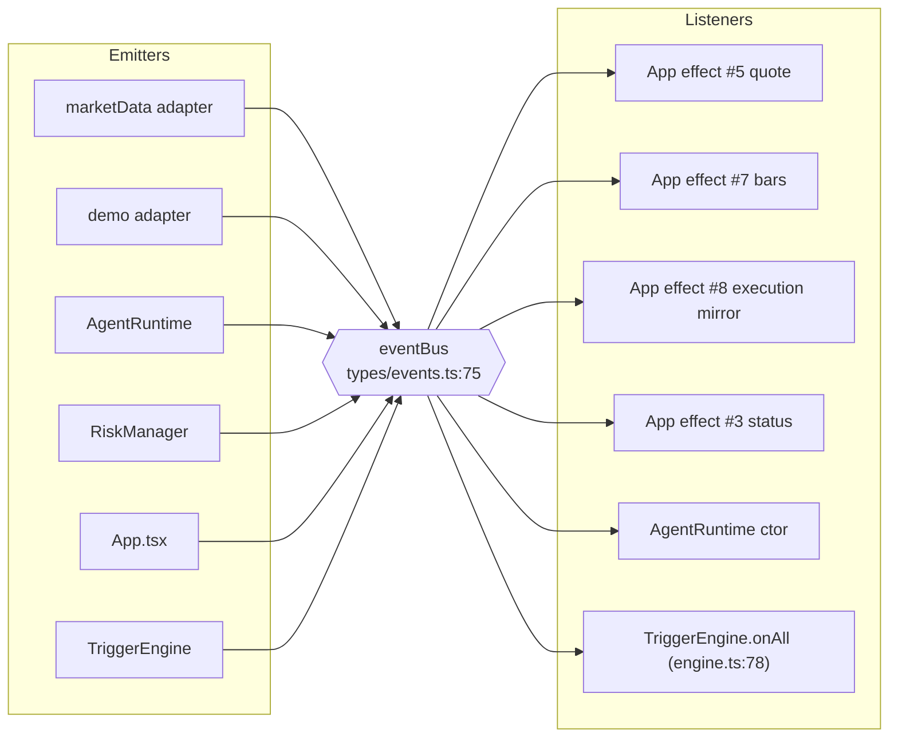

# Event Flow

> **Historical snapshot.** Generated against the pre-GOAT application, in
> which hand-authored *triggers* were part of a bot definition. That
> architecture is gone; the current one is described in
> [architecture.md](../architecture.md) and [trackers.md](../trackers.md).
> Trigger and bot symbol names below are kept verbatim for that reason.

All event-driven relationships in the repository. The browser app has one
`EventBus`; the worker has no emitter (it is pull-based over HTTP); the Python engine
has an in-memory `EventLog` that is queried, not subscribed to.

---

## 1. The `EventBus` — `src/types/events.ts`

**The only pub/sub primitive in the browser app.** A `Map<string, Set<fn>>` with one
wildcard channel.



**Interface** — `types/events.ts:32-72`:
- `on(type, listener): () => void` — `:32-43`, returns an unsubscribe closure
- `emit(event): void` — `:45-62`; typed listeners are wrapped in `try/catch` (`:48-53`),
  wildcard listeners are **not** (`:60`)
- `onAll(listener): () => void` — `:64-72`, registers on the `'*'` channel

**Event vocabulary** — `TradingVibeEvent`, `types/events.ts:3-25` (22 variants).

---

## 2. Event catalogue

### 2.1 Market / execution events

#### `MARKET_QUOTE`
| | |
| --- | --- |
| Payload | `data: Quote` — `types/events.ts:16` |
| Emitted by | `HyperliquidMarketDataAdapter` WebSocket message handler — `marketData.ts:184` (`handleMessage`) |
| Listeners | (a) `App` quote-subscription effect — `App.tsx:611-643`; (b) `TriggerEngine.onAll` `MARKET_QUOTE` branch — `engine.ts:80-110` |
| Downstream effects | (a) `setQuotes` `:614`; `marketDataService.updateLastPrice` `:624`; `hyperliquidDemoAdapter.markToMarket` `:637`. (b) per-agent `TriggerInput` construction `engine.ts:102-105` → `process()` `:106` → possible wake |
| State mutations | `App.quotes`; `MarketDataService` last price; demo position `unrealizedPnL`; `TriggerEngine` eval state / fire bookkeeping |
| Confidence | **CONFIRMED** |

#### `BAR_UPDATE`
| | |
| --- | --- |
| Payload | `{ symbol, timeframe?, bar: Bar, isClosed: boolean }` — `types/events.ts:17` |
| Emitted by | same WebSocket handler — `marketData.ts:184` |
| Listeners | (a) `App` bar-subscription effect — `App.tsx:720`; (b) `TriggerEngine.onAll` → `inputFromDomainEvent` — `engine.ts:113` |
| Downstream effects | (a) upsert `App.bars` by `bar.time`, cap 260 — `App.tsx:724-749`. (b) `BAR_UPDATE` input triggers a **1000-bar fetch** from the environment before evaluation — `engine.ts:127-128` |
| State mutations | `App.bars`; `TriggerEngine.evaluationStates` etc. |
| Confidence | **CONFIRMED** |

#### `ORDER`
| | |
| --- | --- |
| Payload | `data: OrderResult` — `types/events.ts:19` |
| Emitted by | `HyperliquidDemoAdapter.placeMarketOrder` — `demo.ts` |
| Listeners | none registered in `src/` (grep for `'ORDER'` listener registration returns no `eventBus.on('ORDER'`) |
| Downstream effects | none observed |
| Confidence | **CONFIRMED** (typed in the union; no consumer) |

#### `POSITION_OPEN`
| | |
| --- | --- |
| Payload | `data: Position` — `types/events.ts:20` |
| Emitted by | `HyperliquidDemoAdapter.placeMarketOrder` — `demo.ts` |
| Listeners | (a) `App` effect #8 — `App.tsx:811`; (b) `TriggerEngine.onAll` — `engine.ts:80-110`; (c) `AgentRuntime` constructor — `runtime.ts:60-70` registers `POSITION_UPDATE` and `POSITION_CLOSE` (**not** `POSITION_OPEN`) |
| Downstream effects | (a) `refreshFromAdapter()` → `setPositions` `:798` + account mirror `:804-806`. (b) `POSITION_OPEN`-type triggers, `agentByPosition` map `engine.ts:51` |
| State mutations | `App.positions/balance/margin/freeMargin` |
| Confidence | **CONFIRMED** |

#### `POSITION_UPDATE`
| | |
| --- | --- |
| Payload | `data: Position` — `types/events.ts:21` |
| Emitted by | `demo.ts` (mark-to-market and modify paths) |
| Listeners | (a) `App` effect #8 — `App.tsx:815`; (b) `TriggerEngine.onAll`; (c) `AgentRuntime` constructor — `runtime.ts:60-70` → `recordPositionEvent(id,'UPDATED',event.data)` |
| Downstream effects | (a) `refreshFromAdapter()`. (b) `POSITION_UPDATE` triggers. (c) timeline `POSITION_UPDATE` records |
| State mutations | `App` account mirror; `AgentRuntime` timeline; `TriggerEngine` bookkeeping |
| Confidence | **CONFIRMED** |

#### `POSITION_CLOSE`
| | |
| --- | --- |
| Payload | `data: { position: Position; trade: Trade }` — `types/events.ts:22` |
| Emitted by | `HyperliquidDemoAdapter.closePosition` — `demo.ts` |
| Listeners | (a) `App` effect #8 — `App.tsx:819`; (b) `TriggerEngine.onAll`; (c) `AgentRuntime` constructor — `runtime.ts:71-77` → `recordPositionEvent(id,'CLOSED',{position, tradeId})` |
| Downstream effects | (a) `trades.unshift(event.data.trade)` with id dedup `:822-828`, then `refreshFromAdapter()` `:834`. (b) `POSITION_CLOSE` triggers. (c) `positionCorrelations.delete(positionId)` `runtime.ts:1502` |
| State mutations | `App.trades`, `App.positions`, account mirror; `AgentRuntime.positionCorrelations`; `TriggerEngine.agentByPosition` |
| Confidence | **CONFIRMED** |

#### `SIGNAL`
| | |
| --- | --- |
| Payload | `data: SignalEvent` — `types/events.ts:18` |
| Emitted by | nothing in `src/` |
| Listeners | `App.signals` (`App.tsx:212-213`) is passed to `QuotesTab` `:2383` → `TradingChart` markers, but `setSignals` is never called |
| State mutations | none |
| Confidence | **CONFIRMED** |

#### `LOG`
| | |
| --- | --- |
| Payload | `data: LogEntry` — `types/events.ts:23` |
| Emitted by | `App.tsx:460` (`market-discovery-error`), `:499` (`user-load-error`), `:560` (`bars-load-error`), `:690` (`quote-load-error`), `:884` (`order-rejected`), `:931` (`close-rejected`); also `AgentRuntime.start/stop` at `runtime.ts:225-233, :253-261` |
| Listeners | **none** — no `eventBus.on('LOG')` registration exists; `BottomPanel` (the intended consumer) is not rendered by any component |
| State mutations | `App.logs` (`App.tsx:215-216`) has no writer |
| Confidence | **CONFIRMED** |
| Note | This is the documented behaviour of the code: emissions occur, nothing appends them. |

---

### 2.2 Risk events

#### `RISK_VIOLATION`
| | |
| --- | --- |
| Payload | `data: { rule, message, timestamp }` — `types/events.ts:24` |
| Emitted by | `RiskManager.notifyViolation` — `risk.ts:276-285`; called from `validateOrder` `:150` (`KILL_SWITCH`), `:158` (order size), `:165` (positions), `:172` (exposure), `:189` (rate limit), `:198` (daily loss) |
| Listeners | `TriggerEngine.onAll` → `processRiskState(agentId, ts, env, reason)` — `engine.ts:339-346`; feeds `RISK_STATE_CHANGED` triggers (`evaluator.ts:66`) |
| State mutations | `TriggerEngine` evaluation state for risk triggers |
| Confidence | **CONFIRMED** |

#### `STATUS_CHANGE`
| | |
| --- | --- |
| Payload | `data: { mode, status, message? }` — `types/events.ts:25` |
| Emitted by | (a) `RiskManager.setKillSwitch` — `risk.ts:110`; (b) the market-data adapter's connection-status callback — subscribed at `App.tsx:513-518` |
| Listeners | (a) none in `src/`; (b) `setConnectionStatus(status)` `App.tsx:516` |
| State mutations | `App.connectionStatus` (`App.tsx:319-320`) → `BottomNav` `:2143`, `MobileHeader` `:2189` |
| Confidence | **CONFIRMED** |

---

### 2.3 Agent events (12 variants)

| Event | Payload | Emitted at | Consumed by |
| --- | --- | --- | --- |
| `AGENT_STARTED` | `{agentId, timestamp}` | `runtime.ts:217-223` | `TriggerEngine.onAll`; timeline |
| `AGENT_STOPPED` | `{agentId, timestamp}` | `runtime.ts:245-251` | `TriggerEngine.onAll` |
| `AGENT_OBSERVED` | `{agentId, timestamp}` | `runtime.ts:1245-1251` | `TriggerEngine.onAll` |
| `AGENT_REASONING` | `{agentId, iteration, timestamp}` | `runtime.ts:510-517` | `TriggerEngine.onAll` |
| `AGENT_TOOL_REQUESTED` | `{agentId, capability, input, timestamp}` | `runtime.ts:674-682` | `TriggerEngine.onAll`; timeline `CAPABILITY_CALL` `runtime.ts:684` |
| `AGENT_TOOL_RESULT` | `{agentId, capability, result, timestamp}` | `runtime.ts:743-751` | `TriggerEngine.onAll`; timeline `CAPABILITY_RESULT` `runtime.ts:753` |
| `AGENT_DECISION` | `{agentId, decision, timestamp}` | `runtime.ts:1256-1263` | `TriggerEngine.onAll`; timeline `DECISION` `runtime.ts:1298` |
| `AGENT_ACTION_APPROVED` | `{agentId, decision, timestamp}` | `runtime.ts:1265-1287` (non-WAIT) | `TriggerEngine.onAll` |
| `AGENT_ACTION_REJECTED` | `{agentId, reason?, timestamp}` | `runtime.ts:1265-1287` (non-WAIT, invalid) | `TriggerEngine.onAll` |
| `AGENT_ORDER_SUBMITTED` | `{agentId, result, timestamp}` | `runtime.ts:988-995` | `TriggerEngine.onAll`; timeline `ORDER` `runtime.ts:1002` |
| `AGENT_ORDER_FILLED` | `{agentId, result, symbol?, orderId?, positionId?, timestamp}` | `runtime.ts:1079-1101` | `TriggerEngine.onAll` → `processOrderFill` `engine.ts:380-383` → `ORDER_FILLED` triggers (`evaluator.ts:67`); correlationId chain `engine.ts:69` |
| `AGENT_ERROR` | `{agentId, message, timestamp}` | `runtime.ts:464-471, :561-568, :1130-1163` | `TriggerEngine.onAll`; timeline `ERROR` |

**Important (CONFIRMED)** — `inputFromDomainEvent` (`engine.ts:484-505`) handles
**only three** domain events for trigger dispatch: `MARKET_QUOTE` `:485-489`,
`BAR_UPDATE` `:490-494`, `AGENT_ORDER_FILLED` `:495-502`. Everything else returns
`undefined` and never reaches `process()`. The remaining `AGENT_*` emissions are
consumed only by the `TriggerEngine` subscription at `engine.ts:80` and, for the
position events, by the `AgentRuntime` constructor subscriptions.

**`AGENT_ORDER_FILLED` correlation chain** (CONFIRMED, `engine.ts:69`):
`agentId:trade:<tradeId>` → `agentId:position:<positionId>` → `agentId:<triggerId>:<timestamp>`.

---

## 3. Observer-pattern subscriptions (not `EventBus`)

| Mechanism | Location | Producer | Consumer | Teardown |
| --- | --- | --- | --- | --- |
| `onStatusChange(listener)` | `marketData.ts:168` | adapter status changes | `App` effect #3 `App.tsx:513-518` | returned closure called at `App.tsx:524` |
| `subscribeQuote(symbol, cb)` | `marketData.ts:223` | WebSocket tick | `App` effect #5 `App.tsx:611` | closure collected, called at `App.tsx:645-648` |
| `subscribeBars(sym, tf, cb)` | `marketData.ts:229` | WebSocket candle | `App` effect #7 `App.tsx:720` | `unsubscribeBars()` at `App.tsx:754` |
| `on_wake(listener)` | `engine.py:214-216` | `ConditionEngine._enqueue` `engine.py:244` | in-process listeners only; no in-repo subscriber | none |
| `eventBus.onAll` | `engine.ts:78` | `eventBus` | `TriggerEngine` | `stop()` `engine.ts:147-150` |
| `eventBus.on('POSITION_UPDATE'/'POSITION_CLOSE')` | `runtime.ts:60-77` | `eventBus` | `AgentRuntime.recordPositionEvent` | **no teardown captured** (CONFIRMED) |
| React context (`WalletContext`) | `WalletProvider.tsx:51` | Privy state | `useWallet()` consumers | provider unmount |
| React context (theme) | `ThemeProvider.tsx` | user choice | `useTheme()` | provider unmount |
| `appContextStore` | `store.ts:98` | `App.publish` | 11 AI tools | replaced wholesale; **no subscription mechanism** |
| `WakeQueue.pendingWakes()` / `claimWakes` | `durable-object.ts:261, :277` | wake enqueue | external HTTP consumer | `resolveWake` `durable-object.ts:286` |
| DO RPC (`onMarketEvent`) | `durable-object.ts:242` | `POST /feed` fan-out | `Watcher.tick` `watcher.ts:261` | per-isolate lifecycle |

---

## 4. Python `EventLog` — query-based, not subscribed

`server/tradingv_engine/events.py:55-107`.

```
EventLog
   ├ capacity = 2000                                  events.py:64-66
   ├ record(event)                                    events.py:68-72
   │     self._events.append(event)                  ← MUTATION
   │     if len > capacity: self._events.popleft()   events.py:71
   └ emit(event_type, message="", **fields)          events.py:74-80
         builds EngineEvent(timestamp=now) and calls record()
   ↓
Query API
   ├ recent(limit, bot_id, trigger_id, types)        events.py:82-97
   ├ for_bot(bot_id, limit)                          events.py:99-100
   └ __len__                                         events.py:102-103
   ↓ exposed as
GET /events?limit&botId&triggerId                    api.py:360-370
   → engine.log.recent(...)                          api.py:369
   ↓ read by
ConditionEngineClient.events(...)                    engineClient.ts:295
```

**Event types** — `EventType` enum, 15 members — `events.py:20-35`. `EngineEvent`
fields: `type`, `timestamp`, `bot_id`, `trigger_id`, `symbol`, `timeframe`, `message`,
`data` — `events.py:38-47`. `to_json()` drops `None`/`{}`/`""` — `events.py:49-52`.

**Emitters in the engine**:
- `MarketMonitor` holds a reference to the shared log (`monitor.py:143`) and emits
  trigger-fire / evaluation events.
- `ConditionEngine` (`engine.py:86`) aliases `self.log = self.monitor.log`.
- `__main__.py:46` imports `EventType` for `--list-events`.

**Confidence** — exact emission sites inside `monitor.py` were not enumerated line by
line; the log handle is passed at `monitor.py:143` and `engine.py:86`.
**INFERRED** that all monitor emissions go through that shared singleton.

---

## 5. Worker event model

The worker has **no emitter and no subscriber**. It is a synchronous
request→Durable-Object→HTTP-response system.

| Direction | Mechanism | Evidence |
| --- | --- | --- |
| External producer → worker | `POST /feed` with `{ events: MarketEvent[] }` | `index.ts:147-200` |
| Worker → Durable Object | RPC `onMarketEvent(event)` per event | `index.ts:193` → `durable-object.ts:242` |
| Worker → Python engine | `POST {ENGINE_URL}/evaluate` per event | `evaluator.ts:66` |
| Durable Object → external agent | pull only: `GET /watchers/{id}/wakes`, `POST …/wakes:claim` | `index.ts:316, :321` |
| External agent → Durable Object | `POST …/wakes:resolve` | `index.ts:327` |
| No `queue()` consumer exported | — | grep for `queue (` in `watchers/src` → 0 hits |
| No `scheduled` handler exported | — | grep for `scheduled` in `watchers/src` → 0 hits |
| No cron in `wrangler.toml` | — | no `[triggers]` table |

**`MarketEvent` shape** — `contract.ts:263-276`:
`marketEventId`, `market`, `timestamp`, `eventType` (`QUOTE|BAR|SESSION|ORDER|HEARTBEAT`,
`contract.ts:261`), optional `timeframe`, `price`, `volume`, `sequence`, `payload`.

**Rejection reasons** — `contract.ts:278-285`, produced by `shouldProcessEvent`
(`contract.ts:303-351`) in this order:
`PAUSED` `:309` → `NOT_RUNNING` `:310-312` → `WRONG_MARKET` `:313-315` →
`DUPLICATE` (empty id `:316-318`; equal sequence `:330-332`; equal timestamp `:345-347`) →
`STALE` (non-finite timestamp `:319-321`) → `FUTURE_TIMESTAMP` (skew > 5 000 ms `:323-328`) →
`OUT_OF_ORDER` (lower sequence `:333-337`; lower timestamp `:342-344`).

**Rejection is not an event** — it is a per-event return value:
`{ outcome: 'SKIPPED', reason: <EventRejection> }` from `Watcher.tick`
(`watcher.ts:280-287`) surfaced in the `POST /feed` response `results[]`
(`index.ts:194, :199`).

---

## 6. WebSocket event handling

```
Hyperliquid WS server
   ↓ 'wss://api.hyperliquid.xyz/ws'                  marketData.ts:75, :82
new WebSocket(this.wsUrl)                            marketData.ts:180
   ↓ socket.onmessage = (message) => this.handleMessage(message.data)   marketData.ts:184
handleMessage(raw)
   ↓ parses subscription id + channel
   ↓ normalizer.quoteFromBook  /  fromHyperliquidCandle
   ↓
eventBus.emit({type:'MARKET_QUOTE', data: quote})     marketData.ts
eventBus.emit({type:'BAR_UPDATE', symbol, timeframe, bar, isClosed})   marketData.ts
   ↓
App effects (:604, :714) and TriggerEngine.onAll (engine.ts:78)
```

**Asynchrony note (CONFIRMED)** — the handler is synchronous; `App`'s quote callback
(`App.tsx:611-643`) is synchronous; `App`'s bar callback is synchronous. The only
async steps in this path are the `await fetch` calls that establish the subscription
(`marketData.ts:195, :213`) and the `await` inside `TriggerEngine.process` when it
delivers a wake (`engine.ts:252`).

---

## 7. Unsubscribed / orphaned event surface

Recorded because they affect "who consumes this?":

| Surface | Emitted | Consumer |
| --- | --- | --- |
| `eventBus` `'LOG'` | `App.tsx:460, 499, 560, 690, 884, 931`; `runtime.ts:225-233, 253-261` | none registered |
| `eventBus` `'ORDER'` | `demo.ts` | none registered |
| `eventBus` `'SIGNAL'` | none | `App.signals` (never written) |
| `eventBus` `'STATUS_CHANGE'` from `risk.ts:110` | `risk.ts:110` | none registered (the adapter's own status uses the callback path, not the bus) |
| `App.logs` | nothing | `BottomPanel` (`components/terminal/BottomPanel.tsx`) — not rendered by any component |
| `App.backtestResult` | nothing | `BotsTab` `:2527` — always `null` |
| `App.signals` | nothing | `QuotesTab` `:2383` → `TradingChart` |
| `AgentRuntime` constructor bus subscriptions | `runtime.ts:60-77` | no captured unsubscribe closure |
| `WatcherObject` `initialised` flag | `durable-object.ts:71` | declared, never read or written |
| `UserRegistryObject.remove()` | `index.ts:375-380` | no HTTP route calls it |
| `idempotencyKeyFor()` | `ids.ts:79-81` | tests only (`watcher.test.ts:119-124`, `adversarial.test.ts:317-323`) |
| `randomId()` | `ids.ts:84-87` | nothing |
| `WAKE_TTL_MS` | `durable-object.ts:40` | declared + re-exported `:318`, never read |
| `HEALTH_LABELS` | `health.ts:191-198` | exported, never consumed |
| `WakeQueue.capacity` getter | `wake-queue.ts:128-130` | never called |
| `HttpEvaluatorOptions` | `evaluator.ts:20-26` | declared, unused by any class in the file |
| `AccountSnapshot` pydantic model | `api.py:92-105` | never referenced |
| `WILDCARD_HOSTS` | `config.py:133` | declared, never referenced |
| `Series.frame()` | `series.py:89-100` | never called |
| `contract.is_finite_number` | `contract.py:81-82` | never referenced |
| `indicators.required_history` | `indicators/engine.py:561` | re-exported, never called |
| `MarketMonitor.instrument()` | `monitor.py:216-217` | never called |
| `ConditionEngineClient` used by app | — | `TriggerCard.tsx` is rendered by `BotBuilderModal`, which the app does render — so this path **is** reachable, but only from the legacy trigger card inside the bot builder wizard |
