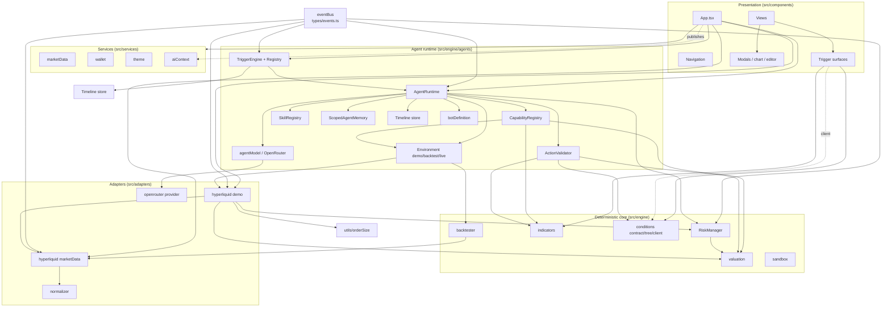

# Module Map

> **Historical snapshot.** Generated against the pre-GOAT application, in
> which hand-authored *triggers* were part of a bot definition. That
> architecture is gone; the current one is described in
> [architecture.md](../architecture.md) and [trackers.md](../trackers.md).
> Trigger and bot symbol names below are kept verbatim for that reason.

17 logical modules, grouped from 108 source files. Each module below follows the same
template so it can be scanned uniformly.

Dependency notation used throughout:

```
A ──imports──▶ B
A ──calls───▶ B.fn()
A ──mutates──▶ B.state
A ──emits───▶ EVENT  ──▶ C
```

---

## Module Dependency Graph



---

## Module Index

| # | Module | Location | Document |
| --- | --- | --- | --- |
| 1 | App Shell | `src/App.tsx`, `src/main.tsx` | [modules/app-shell.md](modules/app-shell.md) |
| 2 | UI Components (non-view) | `src/components/{navigation,layout,chart,modals,terminal,editor}` | [modules/ui-components.md](modules/ui-components.md) |
| 3 | UI Views | `src/components/views` | [modules/ui-views.md](modules/ui-views.md) |
| 4 | Trigger Surfaces | `src/components/triggers` | [modules/pre-goat-trigger-surfaces.md](modules/pre-goat-trigger-surfaces.md) |
| 5 | Agent Runtime | `src/engine/agents/runtime.ts` + `types/memory/model` | [modules/agent-runtime.md](modules/agent-runtime.md) |
| 6 | Trigger Engine | `src/engine/agents/triggers` | [modules/pre-goat-trigger-engine.md](modules/pre-goat-trigger-engine.md) |
| 7 | Capabilities | `src/engine/agents/capabilities` | [modules/capabilities.md](modules/capabilities.md) |
| 8 | Policy & Risk | `src/engine/agents/policy`, `src/engine/execution` | [modules/policy-and-risk.md](modules/policy-and-risk.md) |
| 9 | Bot Definitions | `src/engine/agents/botDefinition.ts`, `builtins`, `explorer` | [modules/bot-definitions.md](modules/bot-definitions.md) |
| 10 | Environments & Backtester | `src/engine/agents/environment`, `src/engine/backtester` | [modules/environments-and-backtester.md](modules/environments-and-backtester.md) |
| 11 | Hyperliquid Adapters | `src/adapters/hyperliquid`, `src/adapters/marketData.ts` | [modules/hyperliquid-adapters.md](modules/hyperliquid-adapters.md) |
| 12 | Condition Engine Client | `src/engine/conditions` | [modules/condition-engine-client.md](modules/condition-engine-client.md) |
| 13 | Services & App State | `src/services/*`, `src/utils/*`, `src/config` | [modules/services-and-state.md](modules/services-and-state.md) |
| 14 | AI Copilot | `src/services/aiContext`, `src/adapters/openrouter`, `components/ai` | [modules/ai-copilot.md](modules/ai-copilot.md) |
| 15 | Python Condition Engine | `server/tradingv_engine/` | [modules/python-condition-engine.md](modules/python-condition-engine.md) |
| 16 | Watcher Fleet | `watchers/src/` | [modules/watcher-fleet.md](modules/watcher-fleet.md) |
| 17 | Test & Acceptance Runners | in-tree `*Tests.ts` / `tests.ts` / `testRunner.ts` | [modules/test-runners.md](modules/test-runners.md) |

---

## Compact Module Table

Read this first. Full detail is in the linked module documents.

| Module | Location | Purpose | Key exports | Depends on | Used by |
| --- | --- | --- | --- | --- | --- |
| **1 App Shell** | `src/main.tsx`, `src/App.tsx` | React mount, view switching, all cross-cutting state | `App`, `triggerEngine`, `triggerRegistry`, `agentRuntime` usage | 2,3,4,5,6,11,13,14 | `index.html` |
| **2 UI Components** | `src/components/{navigation,layout,chart,modals,terminal,editor}` | Reusable presentational + modal components | `BottomNav`, `MobileHeader`, `TradingChart`, `TradeOrderModal`, `MonacoStrategyEditor`, `ErrorBoundary` | 1 (props only) | 1,3 |
| **3 UI Views** | `src/components/views` | Tab screens: Trades, Quotes, Bots, History, Settings | `TradesTab`, `QuotesTab`, `BotsTab`, `HistoryTab`, `SettingsTab`, `BotBuilderModal` | 1,2,9 | 1 |
| **4 Trigger Surfaces** | `src/components/triggers` | Condition-tree builder and live trigger tester | `TriggerBuilderPanel`, `TriggerBuilder`, `TriggerCard` | 6,12 | 1,3 |
| **5 Agent Runtime** | `src/engine/agents/{runtime,types,memory,model,timeline}` | The observe→reason→tool→decide→execute cycle | `AgentRuntime`, `agentRuntime`, `agentModel`, `ScopedAgentMemory` | 6,7,8,11,13,14 | 1,6,10 |
| **6 Trigger Engine** | `src/engine/agents/triggers` | Trigger registration, evaluation, cooldown/caps, fire→wake | `TriggerRegistry`, `TriggerEngine`, `evaluateTrigger`, `evaluateConditionTree` | 5,4,8 | 1,5 |
| **7 Capabilities** | `src/engine/agents/capabilities` | 31 agent tools (24 read-only, 7 execution) | `CapabilityRegistry`, `capabilityRegistry`, `initializeDefaultCapabilities` | 5,8,10,11 | 5 |
| **8 Policy & Risk** | `src/engine/agents/policy`, `src/engine/execution` | Deterministic gates that bound every order | `ActionValidator`, `actionValidator`, `RiskManager`, `riskManager`, `aggregateExposure`, `rejection` | 13, `utils` | 5,7,11,1 |
| **9 Bot Definitions** | `src/engine/agents/{botDefinition,explorer,builtins}` | Canonical bot schema, migration, validation, compilation | `validateBotDefinition`, `migrateBotDefinition`, `compileBotDefinition`, `compileQuickBuild`, `createDeployment` | 5,6,7,4 | 1,3,5,10 |
| **10 Environments & Backtester** | `src/engine/agents/environment`, `src/engine/backtester` | Execution-environment abstraction + bar replay | `DemoEnvironment`, `BacktestEnvironment`, `BacktestSimulator`, `runBotDefinitionBacktest` | 5,7,8,11,9 | 5,1,9 |
| **11 Hyperliquid Adapters** | `src/adapters/hyperliquid`, `src/adapters/marketData.ts` | Live market data (REST+WS) and DEMO fills/positions | `hyperliquidMarketData`, `hyperliquidDemoAdapter`, `normalizer` fns | 8, `types`, `config/env` | 1,5,7,10 |
| **12 Condition Engine Client** | `src/engine/conditions` | Local schema validation + HTTP client to the Python engine | `ConditionEngineClient`, `conditionEngine`, `validateConditionTree`, `DEFAULT_ENGINE_URL` | 4 | 4 |
| **13 Services & App State** | `src/services/{marketData,strategies,userService,theme}`, `src/utils`, `src/config` | Singletons, localStorage persistence, sizing utils | `marketDataService`, `userService`, `ThemeProvider`, `orderSize` helpers | 11, 8 | 1,5,7,11 |
| **14 AI Copilot** | `src/services/aiContext`, `src/adapters/openrouter`, `src/components/ai` | Read-only app projection + OpenRouter chat | `appContextStore`, `AI_CONTEXT_TOOLS`, `openRouterProvider`, `FloatingAIAssistant` | 5,13 | 1 |
| **15 Python Condition Engine** | `server/tradingv_engine/` | Canonical three-state condition evaluation + wake edge detection | `ConditionEngine`, `MarketMonitor`, `evaluate_tree`, `EdgeDetector`, `create_app` | 16 (HTTP), `shared` (JSON) | 16, 4 (legacy) |
| **16 Watcher Fleet** | `watchers/src/` | Durable watcher lifecycle + wake queue | `WatcherObject`, `Watcher`, `WakeQueue`, `HttpConditionEvaluator` | 15 (HTTP) | external feed + external agent |
| **17 Test Runners** | in-tree `*Tests.ts`, `tests.ts`, `testRunner.ts`, `server/tests`, `watchers/test` | Executable specifications, not runtime code | various `run*` / `main` functions | all (test-only) | `package.json` scripts, `pytest`, `vitest` |

---

## Module Relationships at a Glance

### Layering observed in the browser app

```
Components (2,3,4)
     │  props / callbacks only — no direct engine import except
     │  components/triggers/TriggerBuilder.tsx (imports engine indicators)
     ▼
App shell (1)
     │  instantiates & owns
     ▼
Engine singletons (5,6,7,8)   ◀── module 1 creates the only TriggerEngine/Registry
     │
     ▼
Adapters (11)  ──▶ external Hyperliquid
     │
     ▼
Python engine (15)  ◀── HTTP only
     │
     ▼
Watcher fleet (16)  ──▶ HTTP only
```

### Notable direction inversions (CONFIRMED)

| Relationship | Detail |
| --- | --- |
| Module 15 → 16 | The Python engine does **not** import the worker; the worker calls the engine (`watchers/src/evaluator.ts:66`). |
| Module 12 → 15 | The browser's condition client is a runtime caller of the Python engine, but the live app path uses the **in-browser** evaluator (module 6), not module 12. |
| Module 7 → 10 | Capabilities receive an `ITradingEnvironment` and call it (`capabilities/execution.ts:26`); the environment does not know the capability exists. |
| Module 2/3 → 4 | Views own the trigger-lab UI; the engine never imports a component. |
| Module 14 → 1 | `appContextStore.publish` is called by App (`App.tsx:1853`); the AI tools only read. There is no AI→App write path except through callbacks passed as props (`onNavigate`, `onSelectMarket`). |

### Cross-language seams (all HTTP or JSON)

| From | To | Mechanism | Evidence |
| --- | --- | --- | --- |
| `watchers/` | `server/` | `POST {ENGINE_URL}/evaluate` | `watchers/src/evaluator.ts:66` ↔ `server/tradingv_engine/api.py:343` |
| `src/` (legacy) | `server/` | `fetch` to `127.0.0.1:8099` | `src/engine/conditions/engineClient.ts:137` |
| `server/` | `shared/` | JSON file read at import-time | `server/tradingv_engine/contract.py:34,43` |
| `src/` | `shared/` | JSON file read by the parity runner | `package.json:20` → `src/engine/conditions/conditionParity.ts` |
| `src/` | Hyperliquid | HTTPS REST + WSS | `adapters/hyperliquid/marketData.ts:54,180` |
| `src/` | OpenRouter | HTTPS REST | `adapters/openrouter/provider.ts:194` |
| `src/` | Privy | SDK (inside `WalletProvider` only) | `services/wallet/WalletProvider.tsx` |
