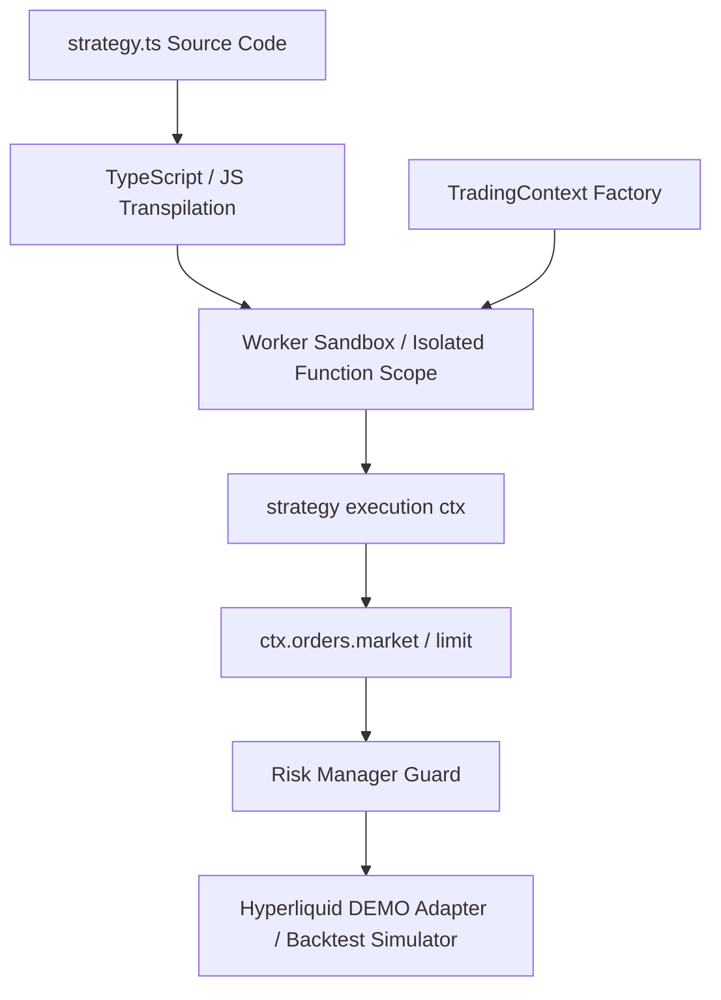

# Strategy Runtime & Sandbox Environment

This document details the isolated strategy execution environment, TypeScript compilation, and the controlled `TradingContext` API in **TradingGOATs**.

---

## 1. Strategy Execution Architecture

Trading strategies in TradingGOATs are written in standard TypeScript and executed in an isolated runtime environment (`src/engine/sandbox/sandboxEnv.ts`).



---

## 2. The `TradingContext` API (`src/types/trading.ts`)

Every strategy exports a single default function accepting a strongly typed `TradingContext`:

```typescript
import { TradingContext } from './types';

export default async function strategy(ctx: TradingContext) {
  // Strategy entry point executed on each evaluation tick or candle close
}
```

### 1. `ctx.market`
Provides read-only access to market prices and historical candles:
* `ctx.market.quote(symbol?: string): Promise<Quote>` — Retrieves current live bid/ask/spread.
* `ctx.market.bars(options?: BarsRequest): Promise<Bar[]>` — Retrieves historical OHLCV bars.

### 2. `ctx.indicators`
Optimized technical indicators:
* `ctx.indicators.sma(values: number[], period: number): number[]` — Simple Moving Average.
* `ctx.indicators.ema(values: number[], period: number): number[]` — Exponential Moving Average.
* `ctx.indicators.rsi(values: number[], period?: number): number[]` — Relative Strength Index (default period: 14).
* `ctx.indicators.macd(values: number[], fast?, slow?, signal?)` — MACD Line, Signal Line, and Histogram.
* `ctx.indicators.bollingerBands(values: number[], period?, stdDev?)` — Upper, Middle, and Lower bands.
* `ctx.indicators.atr(bars: Bar[], period?): number[]` — Average True Range.

### 3. `ctx.account`
Real-time account equity and exposure:
* `ctx.account.balance(): number` — Cash balance.
* `ctx.account.equity(): number` — Net equity including unrealized P&L.
* `ctx.account.margin(): number` — Used margin.
* `ctx.account.positions(symbol?: string): Position[]` — Open positions filtered by symbol.

### 4. `ctx.orders`
Trading operations (routed through Risk Manager):
* `ctx.orders.market(req: MarketOrderRequest): Promise<OrderResult>` — Place market order (`BUY` or `SELL`, volume in units, optional `stopLoss` and `takeProfit`).
* `ctx.orders.closePosition(positionId: string): Promise<void>` — Close an active position.

### 5. `ctx.state`
Cross-tick state persistence:
* `ctx.state.get<T>(key: string): T | undefined` — Retrieve stored state.
* `ctx.state.set<T>(key: string, value: T): void` — Save state across ticks.
* `ctx.state.clear(): void` — Reset state.

### 6. `ctx.log` & `ctx.signal`
* `ctx.log(message: string, data?: unknown): void` — Emit structured execution logs.
* `ctx.signal(event): void` — Emit technical buy/sell chart markers.

---

## 3. Sandboxing Boundaries (Security Policy)

To protect users and host environments, strategy code runs inside a strictly constrained scope:

| Capability | Allowed | Reason |
|---|---|---|
| Read Quotes & Bars | **Yes** | Required for market analysis |
| Run Indicator Math | **Yes** | Built-in technical indicators |
| Place & Manage Orders | **Yes** | Routed through Risk Manager validation |
| Browser DOM (`window`, `document`) | **No (Blocked)** | Strategies must not manipulate UI |
| Network Fetch (`fetch`, `XMLHttpRequest`) | **No (Blocked)** | Prevents external data exfiltration |
| Local Storage Access | **No (Blocked)** | Prevents credential tampering |
| Infinite Loops / Freezes | **No (Timed)** | Execution capped with a 2-second timeout |
