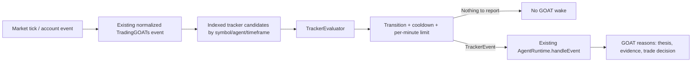

# Trackers

A Tracker is something a GOAT creates in order to *observe* the market. It
is not a signal, it is not a strategy, and it is not a trade. It is a
statement of the form "if this becomes true, wake me", plus the
deterministic machinery that watches for it while the GOAT is dormant.

That is the whole object. A TrackerEvent carries no direction and no
action, because deciding what an observation *means* is the GOAT's job and
doing it in the runtime is exactly the mistake this architecture exists to
prevent.

## The chain

```
GOAT -> Tracker SDK -> Tracker -> TrackerRegistry -> TrackerRuntime
     -> TrackerEvaluator -> market data -> TrackerEvent -> GOAT wake
```

| Layer | File | Responsibility |
| ----- | ---- | -------------- |
| Domain | `src/engine/agents/trackers/types.ts` | `Tracker`, `TrackerEvent`, `TrackerKind` |
| Registry | `src/engine/agents/trackers/registry.ts` | Which trackers exist; validation; the symbol index |
| Runtime | `src/engine/agents/trackers/runtime.ts` | Subscriptions, evaluation fan-out, dedup, cooldowns, lifecycle, expiry, limits, wakes, audit |
| Evaluator | `src/engine/agents/trackers/evaluator.ts` | `evaluateTracker()` — deterministic, stateless apart from previous samples |
| Conditions | `src/engine/agents/trackers/conditions.ts` | The AND / OR / NOT condition tree |
| SDK | `src/engine/goat/trackerSdk.ts` | The only surface a GOAT uses; permissions, validation, ceilings |

The runtime observes. The GOAT reasons. Nothing below the SDK places,
sizes, approves or cancels an order.

## Two kinds of observation

| | What it is | Where it is evaluated |
| --- | --- | --- |
| **Tracker kind** | A single measurement: a price level, a cross, a bar close, a session boundary | This engine, in the browser (`trackers/evaluator.ts`) |
| **Condition tree** | A tree of such measurements combined with `AND` / `OR` / `NOT` | The Python condition engine (`server/`) for the shared contract; the browser evaluator mirrors it for the agent path |

A condition tree is `IF <tree> THEN wake the AI`, where `THEN` is a
closed enum with exactly one value. The browser builds and displays the
tree; the engine measures it. That split is deliberate — see
[architecture.md](./architecture.md#the-measureact-split) for why a second
authoritative implementation of the same language would be a liability
rather than a convenience.

## Conditions

Conditions resolve to one of three states, and the third matters:

| State | Meaning | Reports? |
| --- | --- | --- |
| `TRUE` | Measured, and it holds | Only on a `FALSE → TRUE` edge |
| `FALSE` | Measured, and it does not hold | No |
| `UNKNOWN` | Could not be measured | No |

`UNKNOWN` is what a market that stopped updating, a market the venue will
not trade, or an indicator still warming up produces. It is not `FALSE`:
collapsing the two would make an unmeasurable market look like a market
where your conditions are merely not met, and the runtime's job is to be
honest about the difference rather than convenient.

Full details of the shared contract, its API, and the offline test suite:
[server/README.md](../server/README.md).

## Flow



**Ticks are data; trackers are a question about the data. A TrackerEvent
wakes a GOAT and never implies a trade.**

`TrackerRegistry` validates owner, symbol/timeframe scope, configuration,
lifecycle state and safety fields, and refuses a tracker that cannot be
evaluated. `TrackerRuntime` sorts simultaneous observations by priority
descending then id, evaluates indexed symbol candidates and live trackers
only, enforces cooldown and per-minute limits, records a timeline event,
publishes a `TrackerEvent`, and requests a wake. The agent runtime must
already be running. LIVE event ingestion is rejected outright. Domain
event-bus ingestion remains disabled until the caller explicitly selects
its DEMO/BACKTEST source environment; `ingest(event, environment)` is
available for explicit per-event source selection.

Supported kinds include new closed bars, price thresholds/crosses,
EMA/SMA/RSI/ATR crosses using the existing deterministic indicator
functions, rolling/configured breakouts, spread and ATR volatility
transitions, position updates, actual filled order events, stop/target
proximity, explicitly timed session boundaries, scheduled intervals/local
clock times, and named custom events. Custom events are names/data only: no
custom JavaScript runs.

Scheduled trackers are evaluated only when events are passed to the
runtime. Interval schedules use event timestamps; clock schedules use an
explicit IANA timezone. Backtests should pass historical event time, not
wall-clock time. Session configs contain explicit `startsAt`/`endsAt` epoch
milliseconds and timezone. The event adapter obtains quote/bar/order/position
events from the existing event bus; the backtest helper supplies historical
bar events directly.

Rate limits are per tracker, defaulting to at most 10 events per minute;
the default cooldown is one second. `PRICE_THRESHOLD` reports only after an
observed prior sample was in the opposite state and transitioned; cross
kinds also require previous and current values. `NEW_BAR` deduplicates
timeframe buckets. Scheduled trackers require calling `tickScheduled` with
environment-clock time. Session trackers require `emitSessionBoundaries`
with explicit session configuration. Risk/position event sources require
explicit scoped methods; account state is never fabricated from a global
broadcast.

Failures (bad event/config, unavailable agent, wake error) are recorded as
timeline errors and never produce an execution directly. Risk and execution
remain in the agent runtime and the TradingGOATs risk manager.

---

## Position proximity (asset-agnostic)

`STOP_APPROACHING` and `TARGET_APPROACHING` measure how close a position is
to one of its levels. The maths lives in
`src/engine/agents/trackers/proximity.ts` and is driven entirely by the
instrument's own metadata, which `TrackerRuntime` resolves from the owning
GOAT's environment and attaches to the tracker input as
`state.instrument`.

Config keys, all optional but at least one measurable key required:

| Key | Meaning |
| --- | ------- |
| `withinPrice` | Absolute price distance in the instrument's quote currency |
| `withinPips` | Distance in the instrument's pip unit. Requires `metadata.pipSize` |
| `withinTicks` | Distance in the instrument's tick/price-increment unit. Requires `metadata.tickSize` |
| `withinPercent` | Distance as a percentage of the current price |
| `withinValue` | Monetary distance remaining, valued in the account currency from price distance x quantity x contract multiplier x quote-to-account |

Rules:

* **No Forex assumption.** There is no `100000`/`10000`/`100` lot constant,
  no pip multiplier, no symbol-name heuristic, and no commodity-specific
  branch. A pip or tick threshold is honoured only when the instrument
  declares that size, which discovery sets for Forex pairs and leaves
  undefined for Gold, oil, and indices.
* **A threshold that cannot be measured does not report.** A `withinPips`
  tracker on an instrument with no `pipSize` stays silent rather than
  borrowing the Forex approximation. A partially measurable configuration is
  treated as unmeasurable and stays silent.
* **An unavailable price is never a distance.** With no positive executable
  or mark price, nothing is reported. A null venue price never becomes an
  executable price.
* **Long and short are treated identically.** The distance is absolute, so a
  stop below a long and a stop above a short behave the same way.
* **Edge detection is preserved.** A tracker reports on entry into the band,
  not on every tick inside it, and re-arms after the price leaves the band.
* **It is a wake mechanism only.** The returned string is a reason string; it
  never places, resizes, approves, or signs an order, and the deterministic
  policy and risk layers still run after the GOAT wakes.

Regression coverage lives in `runPositionProximityTests()` in
`src/engine/agents/trackers/tests.ts`: Forex, commodity, and index
instruments for long and short positions, unavailable and null prices, the
pip-size fallback refusal, monetary distance from position quantity, band
re-arming, and the no-order guarantee.

---

## Condition trees (AND / OR / NOT)

`src/engine/agents/trackers/conditions.ts` adds a structured condition tree
on top of the single-kind programs. A tracker may carry either, and a
`conditionTree` in its config takes precedence.

```ts
IF
  ( Gold price crosses above 2500
    AND RSI(14) is at or below 35 )
  OR
  ( Price breaks above the last 20 candles
    AND ATR(14) is at or above 2 )
THEN
  wake the GOAT
```

### Leaves

Every leaf maps onto something the evaluator can already measure, so the UI
cannot offer a capability the runtime lacks:

| Category | Kinds |
| -------- | ----- |
| Market price | `PRICE_LEVEL`, `PRICE_CROSS` |
| Indicators | `INDICATOR_THRESHOLD` (RSI / SMA / EMA / ATR / MACD), `INDICATOR_CROSS` |
| Market structure | `BREAKOUT` |
| Position | `PROXIMITY` (stop / target, metadata-driven distance) |
| Market conditions | `VOLATILITY` (ATR), `SPREAD` |
| Events | `EVENT` (position opened/closed/updated, order filled) |

`TRACKER_CONDITION_CATALOGUE` is the single source of truth for the
builder, and `validateTrackerConditionTree` is the single source of truth
for whether a tree is usable.

### Semantics

* `AND` is true when every child is true; `OR` when any child is; `NOT`
  takes exactly one child.
* `UNKNOWN` is distinct from `FALSE` and is handled explicitly: `AND` with
  an unknown child is unknown, `OR` with an unknown child is still true if
  a sibling is true, and `NOT` of an unknown is unknown. An unmeasurable
  condition can therefore never be presented as satisfied.
* A leaf that cannot be measured reports `UNKNOWN` with a plain-language
  reason (`No live price is available for this market.`). A null or zero
  venue price is never turned into a distance.
* `PROXIMITY` follows the same rules as the standalone proximity kinds: pip
  and tick thresholds require metadata that declares that size.

### Debounce

The report is **edge-detected**. The evaluator records the tree's last root
status per tracker and only reports on a false → true transition, so a
condition that stays true for a hundred ticks wakes the GOAT once. The
`cooldownMs` and `maxEventsPerMinute` controls apply on top of that, and
both are configurable because every wake costs a model call.

### The THEN is a wake

The tree decides only whether the GOAT is worth waking. The wake reason
always ends by saying the GOAT was woken, never that an order was placed.
Policy, risk, and the execution guard still run after the GOAT decides.

### Testing a condition

`evaluateTrackerConditionTree(root, context)` is a pure function, so the
inline preview runs the exact code the evaluator will run and reports each
condition as `TRUE` / `FALSE` / `UNKNOWN` with the measured value. Testing
never executes anything.

---

## Lifecycle

| State | Meaning |
| --- | --- |
| `ACTIVE` | Watching. Only active trackers are evaluated or reported for. |
| `PAUSED` | Temporarily not watching, still registered. Resuming needs no re-authoring. |
| `CANCELLED` | Retired for good. The record is kept so the user can ask why. |
| `EXPIRED` | Its `expiresAt` passed. Retired automatically before every registration. |
| `FAILED` | It could not be evaluated. The reason is retained rather than swallowed. |

A tracker is retired — not deleted — on cancellation, because "why is GOAT
no longer watching this?" has to be answerable.

## Permissions

The SDK is the only surface a GOAT uses, and it re-checks on **every**
call:

| Capability | Grants |
| --- | --- |
| `CREATE_TRACKER` | Deploy a tracker for one of the GOAT's own theses |
| `UPDATE_TRACKER` | Redefine a tracker in place, keeping its identity and history |
| `PAUSE_TRACKER` / `RESUME_TRACKER` | Stop and restart watching |
| `REMOVE_TRACKER` | Retire a tracker permanently |
| `READ_TRACKERS` | See what is being watched, and why |

Holding an SDK reference is not authority. A leaked handle is limited to
what the agent holds at the time of the call, and a tracker belonging to
another GOAT is refused even when the capability is granted.

## Verifying the architecture

`scripts/verify-no-triggers.sh` fails if the retired Trigger symbols, the
`/triggers` routes, a trigger-named file, or a facade shape (a
`TrackerRuntime` that delegates to a trigger engine, a `Tracker` that
extends an `AgentTrigger`, and so on) come back. It runs as part of
`bun run verify`.
